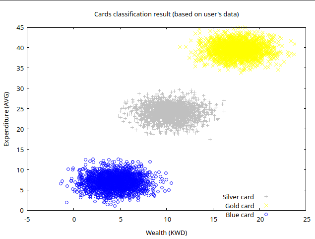
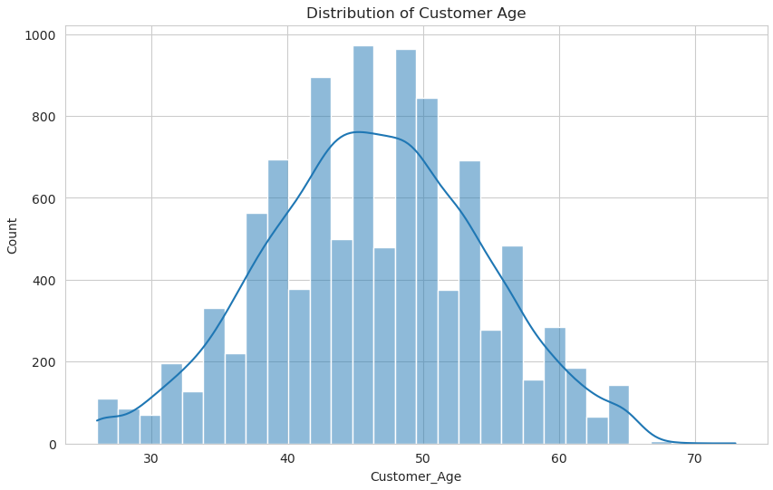
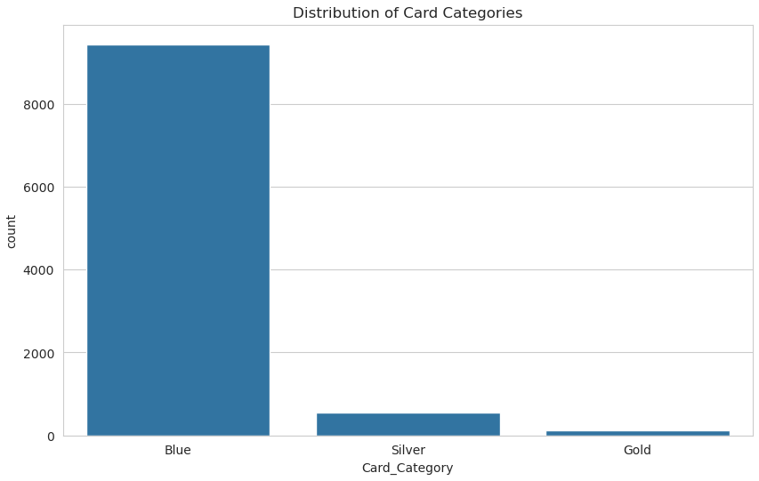
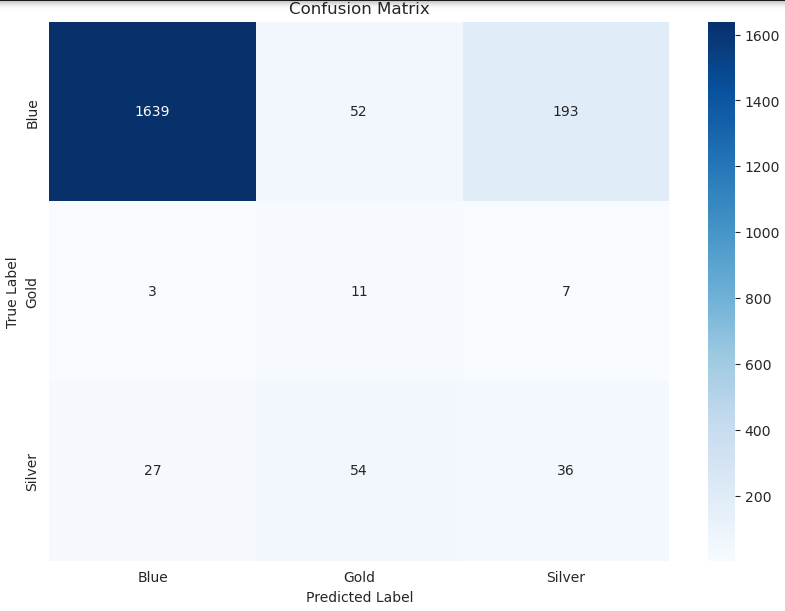

# 📊 Data Analysis and Visualization Projects 🦾

## Python Project: Data Analysis and Visualization Tool 🐍

### Description
This Python project is a data analysis and visualization tool that utilizes popular libraries such as Pandas, Matplotlib, and Seaborn. It allows users to process and analyze data from various sources and create insightful visualizations to communicate trends and patterns effectively.

### Features
- 📥 Data import from different sources
- 🧹 Data cleaning and preprocessing capabilities
- 📈 Descriptive statistics and data analysis tools
- 🎨 Interactive visualizations using Matplotlib and Seaborn
- 📤 Exporting visualizations in various formats
- 🖥️ User-friendly interface for easy data exploration

## Rust Project: Classification Result Visualization Tool 🦀

### Description
The Rust project is a classification result visualization tool that uses the `gnuplot` crate. It involves processing input data, categorizing it into different classes, and visualizing the classification results through scatter plots with distinct symbols and colors for each class.

### Features
- 📊 Input data processing and classification
- 🌌 Scatter plot visualization of classification results
- 🎨 Customization of plot aesthetics such as colors and symbols
- ⚡ Performance optimization using Rust's memory safety and speed
- 💻 Command-line interface for easy execution and visualization

### Example Visualization

## Usage
- 🚀 Clone the repository
- ⚙️ Install the necessary dependencies for each project
- 🐍 Run the Python project using `python main.py`
- 🦀 Run the Rust project using `cargo run` (or run the ./run.sh executeable !)

## Contributions
🎉 Contributions are welcome! Feel free to fork the repository, make improvements, and submit pull requests.

## License
This project is licensed under the MIT License. See the LICENSE file for more details.
